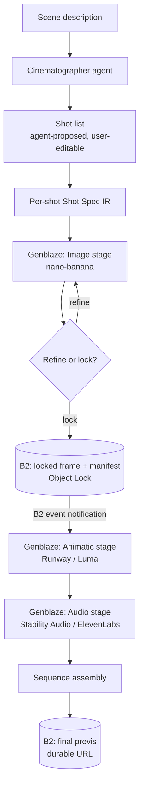
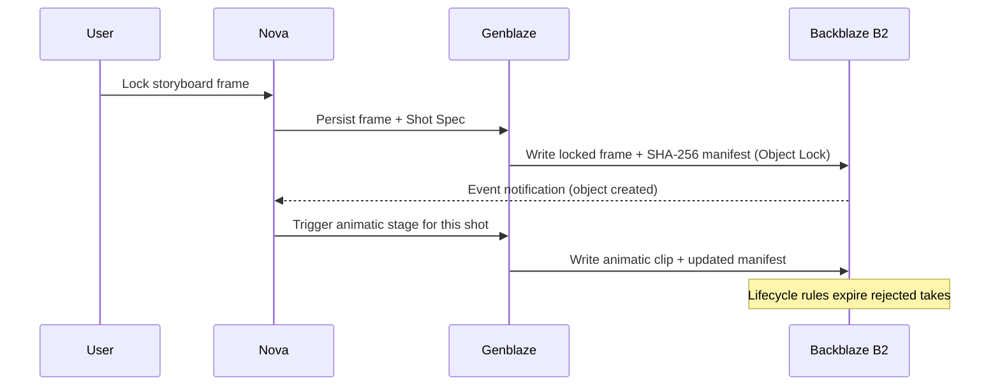

# Nova — Product Requirements Document

**Product:** Nova — AI-powered cinematic previsualization
**Version:** 2.0 (Backblaze Generative Media Hackathon build)
**Status:** Draft
**One-line:** Describe a scene in plain language; Nova returns a shot-by-shot storyboard and compiles it into a moving previs sequence, with every shot reproducible and durably stored.

---

## 1. Summary

Nova turns a natural-language scene description into a *previs sequence*: a short, assembled video that shows how a scene would be shot before a crew, camera, or budget is committed. It does this by acting as a cinematographer — decomposing the scene into individual shots, assigning real cinematographic parameters to each (camera angle, lens, shot size, lighting, composition), generating a controllable storyboard frame per shot, and then bringing the locked frames to motion with scratch audio.

Version 1.0 (built for a prior hackathon) operated on a *single shot* and relied on one image model's native parameter system. Version 2.0 operates on a *whole scene*, moves cinematographic control into Nova's own model-agnostic layer, orchestrates generation across multiple providers through **Genblaze**, and persists every artifact durably on **Backblaze B2**.

---

## 2. Problem

Previsualization is where a scene's visual language is decided — angles, lensing, blocking, light. Today the filmmaker's options are poor:

- **Hire a storyboard artist / previs studio:** $300–$900+ per day, with multi-day turnaround. Out of reach for most.
- **Skip previs entirely:** guess at coverage on set, burning expensive production hours discovering shots that don't cut together.
- **Use generic AI image tools:** they generate *pictures*, not *shots*. They have no concept of camera, lens, or coverage, and produce one disconnected frame at a time — no scene, no continuity, no motion.

The gap: there is no tool that reasons about a scene *cinematographically* and produces a coherent, reproducible, moving previs of it.

---

## 3. Goals & non-goals

**Goals**
- Take a scene description and produce a coherent multi-shot storyboard, then a compiled previs sequence.
- Give the user real, editable cinematographic control per shot.
- Make every shot reproducible and auditable (same spec + model + seed → same frame).
- Run reliably enough to feel like a tool, not a demo — durable outputs, provider fallback, shareable links.

**Non-goals**
- Final-quality rendered footage. Nova produces *previs*, not deliverable film.
- Editing-timeline / NLE features (trimming, transitions beyond assembly).
- Real-time collaboration / multi-user editing (future).

---

## 4. Target users

- **Independent filmmakers & directors** — plan coverage and pitch a look without a previs budget.
- **Advertising / branded-content teams** — "every company is a media company now"; storyboard a spot fast.
- **Film students & educators** — learn and demonstrate cinematographic language cheaply.
- **Writers / creators** — see a scene before pitching it.

---

## 5. Core experience

The user works at the level of a **scene**, and the scope narrows automatically:

**scene description → shot list → per-shot storyboard → per-shot animatic → assembled previs**

1. **Describe the scene.** Plain language: *"A woman in a tattered coat walks through a destroyed city as drones circle overhead, then ducks into a ruined building."*
2. **Shot breakdown (agent-proposed, user-editable).** Nova's cinematographer agent proposes a shot list (e.g. establishing wide → medium on the woman → low-angle insert on the drones → reverse into the building). The user can add, remove, reorder, or reword shots — a human-in-the-loop shot list.
3. **Storyboard generation.** Each shot gets a **Shot Spec** and a generated still. The user refines any shot ("make it high-angle, extremely wide, low-key lighting"); each refinement is a new version.
4. **Lock.** The user locks a frame they're happy with. Locking persists the frame + spec + provenance and triggers the next stage automatically.
5. **Animatic + audio.** Each locked shot becomes a short motion clip with scratch ambient/VO.
6. **Assemble.** Clips are stitched in shot order into one previs sequence with a shareable, durable link.

---

## 6. Key concept: the Shot Spec

The Shot Spec is Nova's core intellectual property and the thing that makes it "understand cinematography" rather than "generate pictures." It is a **model-agnostic cinematographic intermediate representation (IR)** — a structured description of a shot that Nova's agent produces and Genblaze *compiles* down to whatever provider is being called.

```json
{
  "shot_id": "s3",
  "intent": "reveal the scale of the drone swarm above the ruined skyline",
  "camera": { "angle": "low", "height_m": 1.2, "movement": "slow push-in" },
  "lens": { "focal_length_mm": 18, "aperture_f": 2.8 },
  "framing": { "shot_size": "extreme wide", "composition": "rule-of-thirds, subject lower-left" },
  "lighting": { "key": "low-key", "mood": "dramatic shadows", "practicals": ["drone lights"] },
  "grade": { "look": "desaturated teal", "contrast": "high" },
  "subject": { "primary": "woman in tattered coat", "blocking": "walking left-to-right, foreground" },
  "world": ["destroyed buildings", "dumped cars", "airborne drones", "dense fog"],
  "continuity_refs": ["s1_frame", "s2_frame"]
}
```

Because control lives in this IR (not in a single model's parameter schema), Nova is not hostage to any one model's lifespan. When a better image or video model ships, Nova points the compiler at it — no rewrite. This is the reason V2.0 removes the previous hard dependency on one image model.

---

## 7. System architecture



Three layers:
- **Nova agent layer (kept core):** the LLM cinematographer that decomposes scenes and authors Shot Specs. This is where V1's control was *relocated to* — it is now smarter, not thinner.
- **Genblaze orchestration layer:** compiles Shot Specs to providers and runs the image → animatic → audio pipeline with fallback, retry, and provenance.
- **Backblaze B2 storage layer:** the durable, versioned store *and* the event backbone that drives the pipeline forward.

---

## 8. Backblaze B2 integration

### 8.1 What it is and how Nova uses it

Backblaze B2 is S3-compatible object storage. In Nova it is not an afterthought bucket at the end of the pipeline — it is the system's **source of truth and its event backbone**. Every artifact Nova produces (specs, frames, manifests, clips, audio, assembled sequences) lands in B2, and one specific write — the locked frame — *drives the next stage of the pipeline*.

### 8.2 Storage layout

```
nova-previs/                          (B2 bucket)
  projects/{project_id}/
    scene.json                        scene text + shot list
    shots/{shot_id}/
      spec/v{n}.json                  Shot Spec versions
      frames/v{n}.png                 storyboard still versions
      locked/
        frame.png                     locked still            (Object Lock)
        manifest.json                 SHA-256 provenance      (Object Lock)
      animatic/
        clip.mp4
        audio.mp3
    previs/
      sequence.mp4                     assembled scene previs
      manifest.json                    full-chain provenance
```

### 8.3 Which B2 features Nova uses, and why

- **Durable, non-expiring URLs** — every storyboard frame, clip, and previs sequence gets a permanent shareable link. A director can send a client a previs URL that still works next month. V1 held shots in ephemeral session state; V2 makes them real, persistent artifacts.
- **Versioning** — every refinement (v1 → v2 → v3…) of a spec and frame is retained. The user can scrub back through iterations, compare, and revert — a real filmmaking workflow (compare takes, justify a choice to a DP).
- **Object Lock** — applied to locked frames and their provenance manifests, making them **tamper-evident**. A shot's cinematographic "chain of custody" cannot be silently altered after locking.
- **Event Notifications** — when a locked frame object is created, B2 fires an event that triggers the animatic stage. No polling loop; the storage layer *is* the trigger.
- **Lifecycle Rules** — rejected takes and intermediate artifacts are auto-expired so storage stays lean and costs stay predictable. **Hand-built, not a Genblaze passthrough:** Genblaze's `auto_lifecycle=True` only applies two fixed rules (abort incomplete multipart after 7 days, expire noncurrent versions after 30 days) — it has no API for a custom prefix-scoped rule like "expire `frames/reject/*` after 14 days." Nova must configure that rule directly against the B2 bucket (native console/API or raw S3 `PutBucketLifecycleConfiguration`), outside Genblaze.

### 8.4 Advantages

- Turns Nova from a stateless demo into a **stateful product** with shareable, persistent work.
- **Reproducibility & trust:** locked + Object-Locked manifests mean any shot can be reconstructed and verified.
- **Event-driven, not polling:** simpler, cheaper, and more reliable than a job-polling architecture.
- **Cost control** at scale via lifecycle cleanup.

### 8.5 Use cases

1. **Shareable previs link** — director sends a client/crew a durable URL to the assembled scene.
2. **Version scrub** — compare v1 vs v4 of a shot's lighting and revert to the one that cut better.
3. **Audit / hand-off** — hand a locked shot's manifest to a real crew so the on-set setup matches the previs exactly.
4. **Event-triggered pipeline** — locking a frame automatically kicks off its animatic without any manual step.

---

## 9. Genblaze integration

### 9.1 What it is and how Nova uses it

Genblaze is Backblaze's open-source Python SDK for orchestrating generative media workflows across providers, with a unified `Pipeline` API, built-in provenance, and native persistence to B2. In Nova, Genblaze is the **orchestration layer that runs the whole image → animatic → audio chain** and compiles each Shot Spec to the right provider for the stage.

### 9.2 Pipeline stages and providers

| Stage | Purpose | Primary | Fallback / draft |
|---|---|---|---|
| Image | Storyboard still from Shot Spec | Gemini 2.5 Flash Image (nano-banana) | gpt-image-1; Flux via GMI Cloud (fast/cheap draft) |
| Animatic | Motion clip from locked shot | Runway | Luma; Decart (fast draft) |
| Audio | Scratch ambient / VO | Stability Audio (ambient/score) | ElevenLabs (voiceover) |

**Why nano-banana replaces the previous image model:** a storyboard needs two things a generic model lacks — character/world *consistency across shots* and *iterative editing* for the refine loop. Gemini 2.5 Flash Image is strongest on both, making it the closest functional replacement for V1's controllable image engine, while `continuity_refs` in the Shot Spec carry the same character/world across the scene.

### 9.3 Which Genblaze capabilities Nova uses, and why

- **Unified multi-provider Pipeline** — one Shot Spec compiles to any provider; Nova can swap models with a config change instead of a rewrite.
- **Provenance by default** — every run yields a canonical, SHA-256-bound manifest, *provided the run is routed through `ObjectStorageSink`* (URL-only outputs don't populate `asset.sha256` and fail `Manifest.verify()`). For Nova this is transformative: each shot becomes a reproducible *cinematographic recipe* (these params + this model + this seed = this frame). Note the tamper-evidence limit: it catches storage bit-flips/accidental edits, not an attacker with SDK access re-deriving a self-consistent manifest — good enough for "did this shot change after lock," not adversarial-grade attestation.
- **Fallback & retry** — `Pipeline.step(..., fallback_models=[...])` cascades on `MODEL_ERROR`; if Runway stalls, Genblaze falls to Luma and the previs still completes. Core to production readiness.
- **Concurrent multi-take generation** — `Pipeline.abatch_run(prompts, max_concurrency=N)` runs the *same* pipeline N times concurrently (e.g., N seeds), each returning its own `PipelineResult`. This is the real mechanism behind the PRD's "fan-out" language — it's N independent concurrent runs of one pipeline, not a branching fan-out node inside a single pipeline graph. Nova should inspect each `PipelineResult` independently to let a user pick the best take even if one run failed.

**Two unrelated "webhook" concepts — don't conflate them:** Genblaze ships its own `WebhookNotifier`, but it is *outbound only* — it POSTs Genblaze's own pipeline lifecycle events (`step.completed`, `pipeline.failed`) to a URL Nova supplies. It has no connection to B2's bucket-level Event Notifications (see Section 10) and cannot consume them. Nova's lock→animatic trigger uses B2's native event notification feature and Nova's own webhook receiver (`webhooks/lock_handler.py`), not Genblaze's `WebhookNotifier`.

### 9.4 Advantages

- **Model longevity:** Nova is never hard-coded to "today's best model." As the catalog changes, the orchestration layer absorbs it.
- **Reliability:** provider stalls degrade gracefully instead of failing the run.
- **Reproducibility & authenticity:** provenance is automatic, not bolted on.
- **Speed/cost tiers:** cheap/fast providers for drafting, premium for final renders — in the same pipeline.

### 9.5 Use cases

1. **Compile one spec to many models** — draft on Flux (fast/cheap), final on nano-banana (quality) — no code change.
2. **Graceful degradation** — a video provider outage during judging doesn't break the demo; Genblaze fails over.
3. **Multi-take selection** — run three concurrent animatic takes of a locked hero shot via `abatch_run`; user picks the strongest.
4. **Provenance verification** — verify a shot's manifest hash to prove exactly how it was generated.

### 9.6 SDK capability audit (Task 0.3, verified 2026-07-09)

Source: `github.com/backblaze-labs/genblaze` (`main`, in-repo docs last updated 2026-06-17) — repo docs and code read directly, not inferred from general SDK conventions per this project's verification rule.

| Capability | Status | Notes |
|---|---|---|
| Object Lock on manifests | Native | `ObjectLockConfig`, GOVERNANCE/COMPLIANCE modes. Bucket must have Object Lock enabled **at creation** — cannot be added later. |
| SHA-256 provenance manifest | Native, conditional | `Manifest.verify()` needs `asset.sha256` populated, which in practice requires `ObjectStorageSink`. Tamper-evidence stops accidental edits, not an SDK-holder forging a self-consistent manifest. |
| `fallback_models=[...]` | Native | `Pipeline.step()` param, cascades on `MODEL_ERROR`. |
| Multi-take "fan-out" | Native, different shape than assumed | No in-graph fan-out node. Real primitive: `Pipeline.abatch_run(prompts, max_concurrency=N)` — N concurrent runs of the same pipeline, each with its own `PipelineResult`. |
| `ObjectStorageSink` / `S3StorageBackend.for_backblaze()` | Native | Preflight `HeadBucket`, region auto-correction, 16MB multipart w/ 4-way parallelism, `KeyStrategy.CONTENT_ADDRESSABLE`, `get_durable_url()`. |
| B2 Event Notifications → Genblaze trigger | **Not native** | No `event_notification` handling in the codebase. Confirms the correction already noted at the top of this file. |
| Genblaze `WebhookNotifier` | Native, but unrelated to the above | Outbound-only: POSTs Genblaze's own pipeline events (`step.completed`, `pipeline.failed`) to a Nova-supplied URL. Cannot consume B2 bucket events — do not conflate with Nova's B2 event webhook handler. |
| B2 Lifecycle Rules for rejected takes | **Not native** | `auto_lifecycle=True` only covers two fixed rules (multipart abort, noncurrent-version expiry). Custom prefix-scoped expiry (e.g. `frames/reject/*`) must be configured directly against B2, outside Genblaze. |
| Provider adapters (Gemini, gpt-image-1, Flux/GMI Cloud, Runway, Luma, Decart, Stability Audio, ElevenLabs) | Native | All present in Genblaze's adapter matrix and on PyPI (`genblaze-openai`, `genblaze-google`, `genblaze-runway`, `genblaze-luma`, `genblaze-gmicloud`, `genblaze-s3`). |

**Net effect on scope:** two backlog items need hand-built work beyond what the PRD implied Genblaze provides for free — task 0.10 (custom lifecycle rules) and task 5.1/5.2 (event trigger, already correctly scoped as hand-built glue in the backlog).

---

## 10. How B2 and Genblaze work together

The two are complementary: **Genblaze generates and proves; B2 stores and triggers.** Genblaze's provenance manifests are written to B2 under Object Lock; B2's event notification on the locked-frame write is what advances Genblaze to the next stage.



---

## 11. Functional requirements

- **FR1** — Accept a free-text scene description.
- **FR2** — Agent proposes an editable shot list from the scene.
- **FR3** — Generate a Shot Spec and storyboard still per shot.
- **FR4** — Refine any shot via natural language; persist each version.
- **FR5** — Lock a shot; persist frame + spec + manifest to B2 with Object Lock.
- **FR6** — On lock event, generate an animatic clip + scratch audio for that shot.
- **FR7** — Assemble locked shots in order into a previs sequence.
- **FR8** — Expose durable, shareable URLs for frames and the final sequence.
- **FR9** — Support provider fallback for image, video, and audio stages.

---

## 12. Non-functional requirements

- **Reliability** — a single provider failure must not fail the run (fallback required).
- **Reproducibility** — every generated asset carries a verifiable provenance manifest.
- **Durability** — no user-visible artifact lives only in session state; all persist to B2.
- **Latency** — draft tier available for fast iteration; premium tier for final.
- **Cost** — intermediate/rejected artifacts auto-expired via lifecycle rules.

---

## 13. Success metrics

- **Time-to-previs:** minutes from scene description to shareable sequence (vs. days for a previs studio).
- **Refine convergence:** median refinements per shot before lock.
- **Pipeline reliability:** % of runs completing end-to-end (target near 100% with fallback).
- **Reproducibility:** % of shots with a verifiable manifest (target 100%).

---

## 14. Scope

**Hackathon MVP**
- Scene → agent shot list (editable) → per-shot storyboard → refine → lock.
- Genblaze image + animatic + audio stages with at least one fallback each.
- B2 persistence: versioned frames, Object-Locked locked frames + manifests, event-triggered animatic, durable previs URL.
- Assembled previs sequence for a single scene.

**Future**
- Multi-scene projects and sequence-of-scenes assembly.
- Real-time collaboration and review/commenting on shots.
- Upscaling / higher-fidelity final render tier.
- Learned house-style presets (a studio's signature look as reusable grade/lighting).

---

## 15. Risks & mitigations

| Risk | Impact | Mitigation |
|---|---|---|
| Consistency across shots weaker than V1's deterministic control | Storyboard continuity breaks | `continuity_refs` in Shot Spec; nano-banana consistency; agent-side prompt compiler is the priority engineering piece |
| Provider outage during judging | Demo fails | Genblaze fallback on every stage; draft tier as backup |
| Provenance manifest overhead | Complexity | Native to Genblaze — effectively free |
| Storage growth from many takes | Cost | B2 lifecycle rules auto-expire rejects |

---

## 16. Removed in V2 / Added in V2

**Removed:** single-shot-only scope; dependency on one image model's native parameter schema; direct single-provider API calls; ephemeral session-only shot state.

**Added:** scene-level shot breakdown; model-agnostic Shot Spec IR; Genblaze orchestration (image + animatic + audio, with fallback and fan-out); durable B2 storage with versioning, Object Lock, event-driven triggering, and lifecycle cleanup; SHA-256 provenance per shot; assembled previs sequence as the deliverable.
